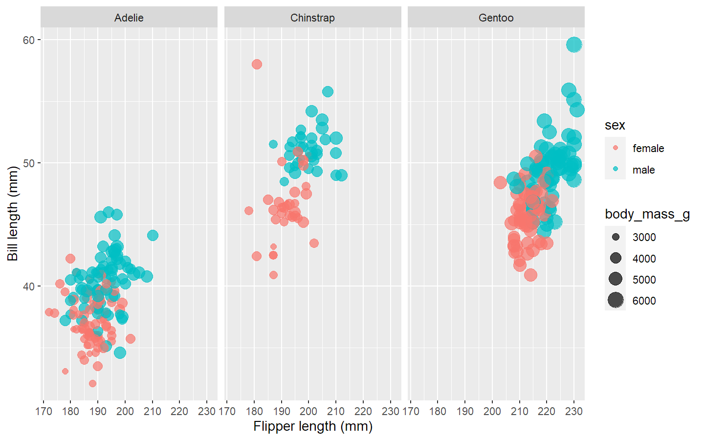

Penguins TidyModels
================
Julián Avila-Jiménez
2020-07-29

## Initial model

Model for [sex of the tree species of
penguins](https://github.com/rfordatascience/tidytuesday/blob/master/data/2020/2020-07-28/readme.md).
Clasification model to distinguish male and female penguins.

## Explore the data

| species | island    | bill\_length\_mm | bill\_depth\_mm | flipper\_length\_mm | body\_mass\_g | sex    | year |
| :------ | :-------- | ---------------: | --------------: | ------------------: | ------------: | :----- | ---: |
| Adelie  | Torgersen |             39.1 |            18.7 |                 181 |          3750 | male   | 2007 |
| Adelie  | Torgersen |             39.5 |            17.4 |                 186 |          3800 | female | 2007 |
| Adelie  | Torgersen |             40.3 |            18.0 |                 195 |          3250 | female | 2007 |
| Adelie  | Torgersen |               NA |              NA |                  NA |            NA | NA     | 2007 |
| Adelie  | Torgersen |             36.7 |            19.3 |                 193 |          3450 | female | 2007 |
| Adelie  | Torgersen |             39.3 |            20.6 |                 190 |          3650 | male   | 2007 |

Penguins data. Source: Gorman, Williams and Fraser, 2014

| island    | species   |   n |
| :-------- | :-------- | --: |
| Biscoe    | Adelie    |  44 |
| Biscoe    | Gentoo    | 124 |
| Dream     | Adelie    |  56 |
| Dream     | Chinstrap |  68 |
| Torgersen | Adelie    |  52 |

Number of individuals by Species by Island

| species   | sex    |  n |
| :-------- | :----- | -: |
| Adelie    | female | 73 |
| Adelie    | male   | 73 |
| Adelie    | NA     |  6 |
| Chinstrap | female | 34 |
| Chinstrap | male   | 34 |
| Gentoo    | female | 58 |
| Gentoo    | male   | 61 |
| Gentoo    | NA     |  5 |

Sex by Species

| year |   n |
| ---: | --: |
| 2007 | 110 |
| 2008 | 114 |
| 2009 | 120 |

The number of recods by Year

### Basic exploratory analisys

``` r
penguins %>% 
  filter (!is.na(sex)) %>% 
  ggplot (aes (flipper_length_mm, bill_length_mm, 
               color= sex, size= body_mass_g))+
  geom_point (alpha= 0.7)+
  labs(x="Flipper length (mm)", y="Bill length (mm)")+
  facet_wrap (~species)
```

<!-- -->

``` r
penguins_df <- penguins %>%
  filter(!is.na(sex)) %>%
  select(-year, -island)
```

## Building a model to predict the sex by the other variables

``` r
library(tidymodels)

set.seed(123)
penguin_split <- initial_split(penguins_df, strata = sex)
penguin_train <- training(penguin_split)
penguin_test <- testing(penguin_split) #use to test perfonmance for the model

set.seed(123)
penguin_boot<- bootstraps(penguin_train) #25 different bootstraps of n=250
penguin_boot
```

    ## # Bootstrap sampling 
    ## # A tibble: 25 x 2
    ##    splits           id         
    ##    <list>           <chr>      
    ##  1 <split [250/93]> Bootstrap01
    ##  2 <split [250/92]> Bootstrap02
    ##  3 <split [250/90]> Bootstrap03
    ##  4 <split [250/92]> Bootstrap04
    ##  5 <split [250/86]> Bootstrap05
    ##  6 <split [250/88]> Bootstrap06
    ##  7 <split [250/96]> Bootstrap07
    ##  8 <split [250/89]> Bootstrap08
    ##  9 <split [250/96]> Bootstrap09
    ## 10 <split [250/90]> Bootstrap10
    ## # ... with 15 more rows

### Basic logistic regression model

``` r
glm_spec <- logistic_reg() %>%
  set_engine("glm")

glm_spec
```

    ## Logistic Regression Model Specification (classification)
    ## 
    ## Computational engine: glm

### Random forest model

``` r
rf_spec <- rand_forest() %>%
  set_mode("classification") %>%
  set_engine("ranger")

rf_spec
```

    ## Random Forest Model Specification (classification)
    ## 
    ## Computational engine: ranger

### Preprocessor and model

``` r
penguin_wf<-workflow() %>% 
  add_formula(sex ~ .)
penguin_wf
```

    ## == Workflow ===================================
    ## Preprocessor: Formula
    ## Model: None
    ## 
    ## -- Preprocessor -------------------------------
    ## sex ~ .

``` r
glm_rs <- penguin_wf %>%
  add_model(glm_spec) %>%
  fit_resamples(
    resamples = penguin_boot,
    control = control_resamples(save_pred = TRUE)
  )

glm_rs
```

    ## # Resampling results
    ## # Bootstrap sampling 
    ## # A tibble: 25 x 5
    ##    splits           id          .metrics .notes           .predictions
    ##    <list>           <chr>       <list>   <list>           <list>      
    ##  1 <split [250/93]> Bootstrap01 <NULL>   <tibble [1 x 1]> <NULL>      
    ##  2 <split [250/92]> Bootstrap02 <NULL>   <tibble [1 x 1]> <NULL>      
    ##  3 <split [250/90]> Bootstrap03 <NULL>   <tibble [1 x 1]> <NULL>      
    ##  4 <split [250/92]> Bootstrap04 <NULL>   <tibble [1 x 1]> <NULL>      
    ##  5 <split [250/86]> Bootstrap05 <NULL>   <tibble [1 x 1]> <NULL>      
    ##  6 <split [250/88]> Bootstrap06 <NULL>   <tibble [1 x 1]> <NULL>      
    ##  7 <split [250/96]> Bootstrap07 <NULL>   <tibble [1 x 1]> <NULL>      
    ##  8 <split [250/89]> Bootstrap08 <NULL>   <tibble [1 x 1]> <NULL>      
    ##  9 <split [250/96]> Bootstrap09 <NULL>   <tibble [1 x 1]> <NULL>      
    ## 10 <split [250/90]> Bootstrap10 <NULL>   <tibble [1 x 1]> <NULL>      
    ## # ... with 15 more rows
